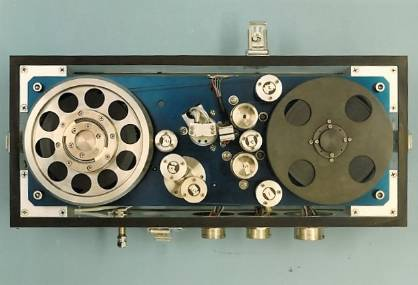
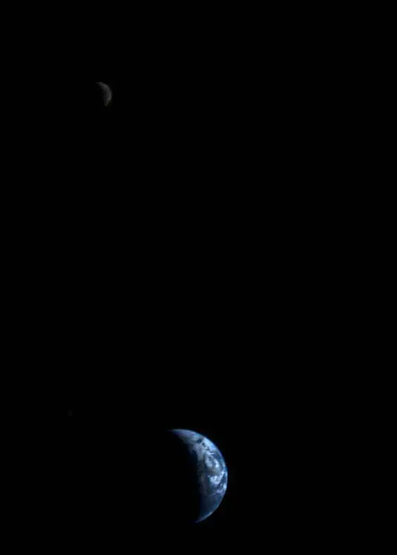
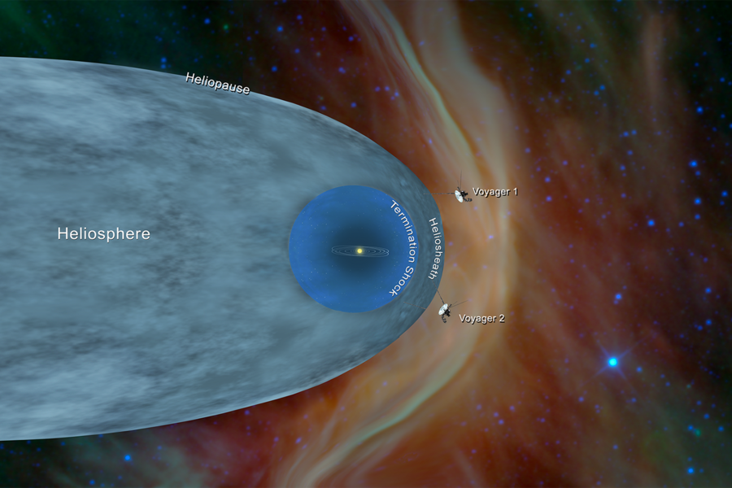
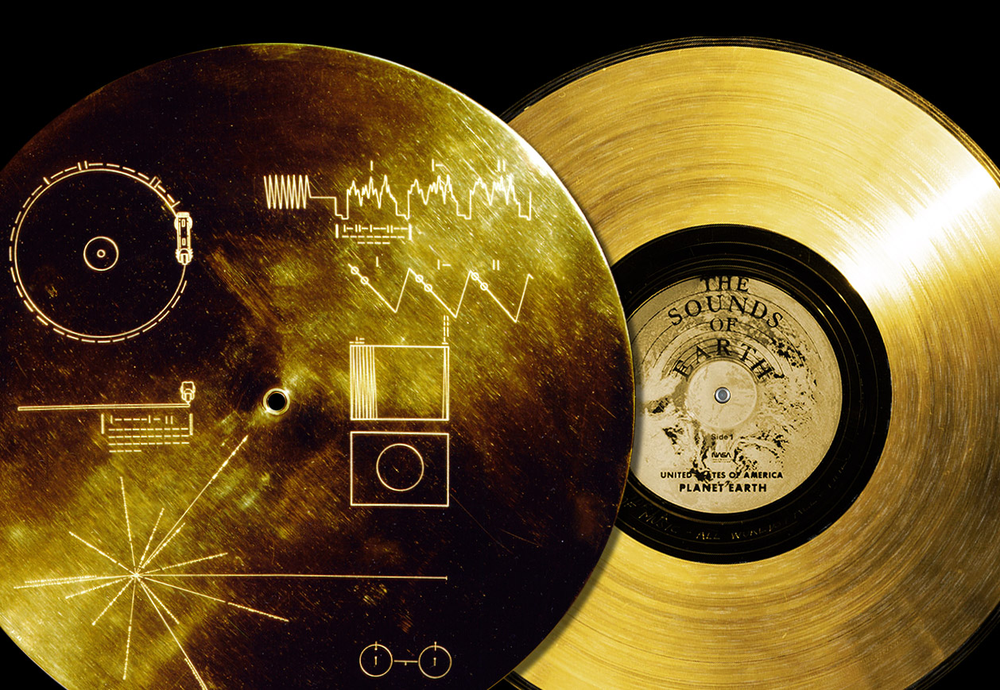

# What Voyager Saw: A 50-Year Journey Through Space

**Author:** Jegrami 
**Date:** 2025-03-04 
**Updated:** 2026-02-11

In 1977, NASA launched two robotic explorers into space. We know them as Voyager 1 and Voyager 2. The job of these twin spacecraft was to explore our solar system’s outer planets, taking plenty of pictures along the way and sending them back to Earth. The goal? Unravel the mysteries surrounding the outer planets and our solar system. Those two robots represent the greatest act of exploration humans have ever undertaken. They represent the height of human curiosity, audaciousness, creativity, innovation, and resilience — qualities that make us special.

The Voyager space probe gave us some of the earliest, most breathtaking images of the universe beyond our little bubble earth. More than just a science machine, the Voyager is now a symbol of humanity at its best. Forty-nine years later, 25 billion km traveled, and currently inside interstellar space — the Voyager is still alive and kicking, sending us new, incredible information about the universe, right from the boundary of our solar system! 

Twenty-five billion km away from the earth. This is the farthest any human-made object has ever traveled. By November 2026, exactly 49 years and 2 months since its launch, voyager 1 would have traveled the distance light travels in a day, about 16.1 billion miles (25.9 billion kilometers). The spacecraft is currently traveling at breakneck speed of around 11 miles per second (17.7 km/s). For context, a bullet fired from an 
AR-15 riffle travels at roughly 0.6 miles per second. This means voyager 1 is moving 
more than 20 times faster than a speeding bullet.  

The Voyager ships (Voyager 1 & 2) have sent images of planets we have never seen up close before, like Uranus and Neptune. They have helped us discover things scientists never even thought were there to be discovered in the first place. They have greatly improved, and most times altered, our understanding of the physical universe. 

This is a long-ass, non-technical article (written by an ordinary, non-science writer) about the Voyager space probes: their mission, their journey so far, their breathtaking discoveries, and when we expect these machines to die (sadly, all things must come to an end). 

---

It’s interesting to me that the spacecraft we are talking about here are powered by archaic tech. The machines we have at the cutting edge of space exploration are not shiny, modern devices. No. There are old computers, some with memory capacity smaller than that of a modern-day calculator, using 8-track magnetic tapes from the 1970s!

 
*The 8-track digital tape recorder aboard the Voyager*

The Voyager was originally designed for a 5-year mission to Jupiter, Saturn, Uranus, and Neptune ... and some of their biggest moons. Their goal was to explore, take pictures, and find out what was going on around there. But when the twin spacecraft completed their flyby of those planets around 1989, merely 12 years after their takeoff from Earth, NASA scientists decided to extend their mission to go beyond our solar system and into interstellar space. 

“Interstellar space”, as the name implies, is the vast area between stars. It means going beyond our solar system (the Sun, our star) and probably toward another star, like our closest neighbor, the Proxima Centauri, which is about 40 trillion km away. That’s not exactly ‘close, ’ but OK. 

The Voyager’s interstellar mission comprises a journey through three distinct regions in space: the termination shock, the heliosheath, and finally, interstellar space. 

**termination shock**
: The point where the Sun's hot wind suddenly slows down, where the speed of the solar wind reduces sharply from supersonic (faster than sound) to subsonic (less than the speed of sound). This speed reduction is caused by the Sun’s wind being pushed back by dust, gas, and other particles that fill up the space between stars (also called the *interstellar medium*). 

**heliosheath**
: Just beyond the termination shock is the heliosheath. This is where the solar wind moves much more slowly because it’s now interacting with — and being deflected by — the interstellar medium.

**interstellar space**
: As explained above, this is simply the "space" between stars. For example, the space between the Sun and Proxima Centauri is generally called interstellar space. 

The Voyager mission was possible only because of a rare planetary alignment that occurs roughly once every 175 years. During this unique event, Jupiter, Saturn, Uranus, and Neptune all lined up on one side of the solar system, creating a perfect opportunity for Voyager to reach all of them in a single journey, using the gravity of one planet to accelerate the ship on to the next. Scientists call this "gravitational assist".

A gravity assist is a technique where a spacecraft uses a planet’s gravity to adjust its speed and trajectory, allowing it to travel farther while conserving fuel. For example, when the voyager 1 passed through Jupiter and Saturn, their massive gravity pulled it in and then flung it forward like a slingshot, helping it gain huge speed without losing fuel. 

Before 1977, the last time this planetary alignment happened was during the reign of Napoleon, around 1802! So NASA was racing against time. If they missed this once-in-a-lifetime window, they’d have to wait until the next alignment . . . in 2152. 

It’s been nearly half a century now. The Voyager mission is still alive, and the twin spacecraft continue their silent journey into interstellar space, sending back data from regions no human probe has explored before. The big question now is: how have they lasted this long? These old machines have exceeded everyone's expectations. Even the engineers who built them never imagined they would still be operating today, outliving some of their own creators. So what’s their secret? What were these spacecraft made of?

## Design Decision of the Voyager

### The fuel source

This was the first thing I wondered. What kind of fuel keeps these spacecraft running? Turns out, it's something called a **radioisotope thermoelectric generator (RTG)**. It works by converting heat from the decay of plutonium-238 (whatever that means) into electricity, which powers the ship. 

At launch, each Voyager generated 157 watts of power &mdash; less than the wattage of a handheld vacuum cleaner. It’s remarkably long-lasting, though. Despite its running for nearly half a century now, scientists believe there might still be enough power to keep the Voyager on, possibly through its 50th birthday in 2027. In other words, 2027 could be the year Voyager finally falls silent. You can pause here and sob. I did.

### The tech stack

The Voyager was equipped with 11 scientific instruments designed to study planets, magnetic fields, plasma, and cosmic radiation. In addition to these instruments, Voyager had **gyroscopes** for stabilization, **star trackers** for navigation, and 16 **hydrazine thrusters** (with another 8 as backups) used for course correction and orientation. 

Those backup thrusters helped a lot . . . because in 2017, two of Voyager 1’s main thrusters failed. And the backups had to be activated. These backup thrusters, called **Trajectory Correction Maneuver (TCM)** thrusters, had not been used since Voyager 1’s flyby of Saturn in 1980. They found work after 37 years of idleness. Imagine being on standby for nearly 4 decades. But guess what. When it came time for them to step in, they did. They worked perfectly. What lovely machines! 

The Voyager has some custom-made computers built into it, such as the **Computer Command System (CCS)** and the **Voyager Flight Data System (FDS)**. It also has wide-angle and narrow-angle lens cameras controlled by a CCS whose goal in life is to run some fault detection and correction routine software. 

Another vital equipment onboard Voyager is the **Attitude and Articulation Control Subsystem**. Weird name. But the ‘attitude’ just means a system that controls the Voyager’s antenna to ensure that it is always pointing toward Earth. This is important. Without the antenna pointing toward Earth, Voyager cannot send or receive information from NASA’s Deep Space Network (DSN). DSN is a lineup of three giant radio antennas placed in strategic positions around the world to support communication with interplanetary spacecraft. It’s the largest and most sensitive scientific telecommunications system in the world, according to NASA.

About that Voyager antenna. It’s just 3.7 meters wide, roughly the size of a trampoline. Being an old technology, its energy output is really small &mdash; so small that, at such vast distance from Earth, its signal would be undetectable without precise alignment of the antenna. So to maintain communication, it must always face Earth. The antenna’s memory is an 8-track digital tape recorder that can store only 536 megabytes, just enough for about 100 images at a time, before sending the data to Earth. Compared with the memory capacity of modern-day devices, 536 MB is really, really small. But that’s what the Voyager uses for real-time communication with NASA’s DSN.

Throughout Voyager’s journey, NASA scientists have constantly anticipated possible obstacles in its path and programmed solutions to overcome them. And so far, they have always succeeded. But there's yet one dreadful challenge left for Voyager to face, one that is surely giving scientists sleepless nights: the extremely cold regions of interstellar space, a place so far at the edge of the solar system that the Sun’s warmth is barely a whisper. Imagine how cold that region would be. Pluto is freezing, but interstellar space is unimaginably colder! Of course, the Voyager has some heaters on board that keep the machine warm and operational. But most of them have been turned off over the years to conserve energy. I mean, the poor things have operated smoothly for more than 45 years and continue to do so. If anything, they’ve earned their rest.

## Some of Voyager’s Biggest Discoveries. 

What have Voyager 1 &amp; 2 seen in their nearly 50-year journey in space? What wonders have they captured in their cameras? What new mysteries have they revealed? What old beliefs have their data debunked? To answer that, let’s rewind to 1977, the year they launched, and follow the incredible path they took.

On August 20, 1977, Voyager 2 lifted off from Cape Canaveral, Florida. Two weeks later, on September 5, Voyager 1 followed. Both were headed for Jupiter. The spacing of the two launches was deliberate. Voyager 1 was set on a shorter path to Jupiter, which is why it took off last.

> [!NOTE] 
> it seems like I'm going to be referring to the individual ships a lot. So to save
>  myself some typing, and to save you some time, may I just call them V1 and V2? 
> Thanks.

So although V2 went up two weeks before V1, by December 15 of the same year, V1 had overtaken V2, thanks to the shorter trajectory that V1 followed. 

### The mission timeline

#### 13 days: the first photo arrives

Just 13 days after launch, V1 sent back its first photo of the Earth and its moon, from 11 million km away. This would be the first of tens of thousands of photos it would capture throughout its journey.

 
*Photo of Earth and its moon, captured by Voyager 1 from 11 million km away*

#### 2 Years: Voyager approaches Jupiter

After two years, Voyager arrives the giant planet Jupiter, its very first mission target, located 714 million km away. V1, traveling at 17 km/s, arrived on March 5, 1979. And V2, moving a bit slower at 15 km/s, arrived four months later, on July 9, 1979.

 
*Jupiter and its moons, Io (left) and Europa*

When the first images of Jupiter started coming in, scientists discovered and were surprised by the sheer turbulence in the atmosphere: supergiant tornadoes, storms, whirlwinds, and plumes strikingly similar to the ones found in many places in space. Scientists discovered that Jupiter is beset with them. V1 proved that Jupiter, like Saturn, also has rings. It took photos of volcanic activity in Io, one of Jupiter's biggest moons. They’re volcanic hotpots and lakes of liquid fire scattered all over the moon’s surface. We now know it's the most geologically active site in all our solar system. Scientists also found out that Jupiter’s Ganymede was the largest moon in our solar system, not Saturn’s Titan. 

As V1 approached Jupiter, it took a series of images over a period of 60 Jupiter days (a day on Jupiter is 10 hours on Earth). These images were spliced together to create the following "Blue movie" of Jupiter (so called because it was built from Blue filter images):

 
*A timelapse image of Jupiter taken by Voyager 1 over a period of 60 Jupiter days*

Notice the Great Red Spot on the surface of the planet? That's Jupiter's most recognizable feature: a swirling, never-ending storm that has been raging for more than 150 years now. It's the biggest storm in the entire solar system, roughly 1.3 times the size of Earth!

#### 21 months (November 1980): V1 approaches Saturn

Saturn has long been known as the ring planet, since Galileo identified 5 of its rings as far back as in the 1600s. V1 showed us that there are not 5 but 100s of them. Sadly, we also learned that Saturn is losing its rings. Gravitational force seems to be pulling the rings into the planet, causing some dusty rain of ice particles in the planet's atmosphere. Scientists also found out our some weird shit about Enceladus, one of Saturn's 17 moons. The tiny world is constantly spewing 3kg of water vapor per second, up to 10,000 km high above its surface. In fact, this phenomenon is responsible for one of Saturn’s ice rings.

This is the point where V1 and V2 part ways and go in opposite directions forever. Saturn’s gravity had significantly increased the speed of V1, propelling it in a different direction. V1’s course was now directed toward interstellar space, while V2 made its journey around Saturn and continued toward Uranus and Neptune. To this day, V2's flybys of those distant ice giants remain the only ones in human history.

#### 5 years (January 1986): V2 reaches Uranus

V2 flew really close to the green planet, just 81,000 km above its surface. From this flyby, scientists learned that, unlike Jupiter and Saturn, composed mostly of hydrogen and helium, Uranus has a deep ocean of ammonia, methane, hydrogen sulfide, and water, with a core of rock and ice. They also discovered that Uranus has 27 moons and, strangely, no visible clouds. But the most surprising revelation to me is that Uranus holds the title of the coldest planet in our solar system &mdash; chillier than even Neptune!

#### 1989: V2 reaches Neptune, its final target 

Three years after its Uranus flyby, traveling at 54,000 km per hour, V2 finally arrives at Neptune, the most distant planet in our solar system. This was in August 1989, 12 years after its takeoff from Earth. V2 captured really beautiful, close-up photos of Neptune, flying by the blue planet at just 5,000 km away from its surface, the closest flyby of any man-made object. V2 also remains the only spacecraft to have ever visited Neptune.

Hydrogen and methane gas are the common elements found on Neptune. The latter is what gives Neptune its blue appearance. Another strange thing about the planet is its high-speed winds, some of them blowing at 2,400 km per hour, the strongest ever recorded in our solar system. And Neptune’s largest moon, Triton, is the coldest planetary body in our solar system, even colder than Uranus! Triton also has plumes on its surface like Jupiter, which may indicate the presence of volcanoes. Scientists love it when they discover evidence of activity anywhere in the cosmos, even if it’s dangerous and destructive,  like hot lava shooting out of mountains. 

And with Neptune, V2 had reached the final stop of what NASA dubbed The Grand Tour. At this time, V1 was already 6 billion km away from the Sun, heading toward interstellar space. To conserve its energy for the remaining long journey, NASA scientists decided to turn off its camera — forever. But before that, with the advice of the renowned physicist Carl Sagan, V1’s camera was turned toward Earth to take one last picture of home. And so, on the 14th of February 1990 (Valentine's Day!), V1 took this famous pale blue dot image of Earth, about 0.12 pixels in size:

 
*Earth at 6 billion km from the Sun appearing as just a point of light about 1 pixel in size*

Carl Sagan best described this picture, in his all-so-poetic way:

> Look again at that dot. That’s here. That’s home. That’s us. On it everyone you have
>  ever loved, everyone you know, everyone you ever heard of, every human being who 
> ever was, lived out their lives. The aggregate of our joy and suffering. Thousands 
> of confident religion, ideologies, and economic doctrines; every hunter and forager,
>  every hero and coward, every creator and destroyer of civilization, every king and 
> peasant, every young couple in love, every mother and father, hopeful child, 
> inventor and explorer; every teacher of morals, every corrupt politician, every 
> ‘superstar’, every ‘supreme leader’, every saint and sinner in the history of our 
> species lived there — on a mote of dust suspended in a sunbeam. There is perhaps no 
> better demonstration of the folly of human conceit than this distant image of our 
> tiny world. To me, it underscores our responsibility to deal more kindly with one 
> another and to preserve and cherish the pale blue dot, the only home we have ever 
> known. 

No one could have said that better.

#### December 2004: V1 crosses the termination shock 

After capturing the famous *Pale Blue Dot* image in February 1990, V1 spent nearly 15 years drifting in silence. Then, in December 2004, something happened. The spacecraft recorded a sharp drop in solar wind speed and a surge in galactic cosmic rays, signaling that it had entered the region called the termination shock. Three years later, in August 2007, V2 experienced the same transition, confirming that it, too, had crossed the termination shock. But neither probe had yet left the solar system (they were still well within the heliosphere). That final milestone would come years later, when they crossed the heliopause.

Some really big words that need explaining here. The *heliosphere* is the protective bubble of our solar system separating us from the rest of the galaxy. It is created by the Sun’s wind and extends to about 11 billion miles from the Sun, protecting Earth and other planets in our solar system from the harsh radiations of the outside galaxy beyond. The *heliopause*, on the other hand, is the true boundary between our solar system and the outer galaxies, the very edge of the heliosphere. Beyond here is the vast area between stars, called interstellar space.

 
*Voyager 1 & 2 crossing the heliosphere*

Now, back to our voyagers. 

Having crossed the termination shock, V1 entered the heliosheath, which is the outermost layer of the heliosphere, in between the termination shock and the heliopause. This is where the solar wind clashes with the wind coming from outside our protective bubble, the pressure building up as our Sun's wind presses against the gases and dust particles from interstellar space, making this area denser and more chaotic. Scientists monitored as cosmic ray levels from the outside galaxy steadily increased, a sign that V1 was nearing the edge of the Sun’s protective bubble.

#### August 25, 2012: V1 enters interstellar space! 

For years, V1 and V2 drifted through the heliopause, the boundary region of our solar system, sending back data about the interaction between the solar wind and interstellar space. Then, on August 25, 2012, something extraordinary happened: the solar wind nearly vanished completely, replaced by a flood of particles from deep space. V1 had officially become the first human-made object to leave our solar system and enter into interstellar space. V2 also crossed this boundary on Nov. 5, 2018. To date, the twin spacecraft are the only human-made objects to ever travel this far.

## The Golden Record

Scientists aren't sure how much longer these cosmic travelers will last before their power runs out and we lose contact with them forever. But even after their energy fades and their instruments fall silent, the twin spacecraft will continue their journey deeper and deeper into space, probably for billions of years. They will make plenty more fascinating discoveries, even though they won’t be able to tell us about it. And should they encounter alien life, each of the Voyager ships carries a message, called **the Golden Record**, which is a phonographic gold-plated copper disk designed to tell the story of Earth to any distant intelligence that may one day encounter it.

 
*the golden record aboard the Voyager*

Curated for NASA by Carl Sagan and his team, the record holds **115 images** showcasing life on Earth, along with various natural sounds, such as ocean waves, the rustling of wind and rain, the songs of birds and whales. It contains spoken greetings in **55 languages**, messages from the then-U.S. president and the U.N. Secretary-General, and a collection of music spanning continents and centuries, from classical symphonies to folk melodies to rock and roll. It even contains simple, intimate sounds like human footsteps and laughter. The cover of the record carries instructions for how to play the record, written in symbolic language. 

Titled “The Sounds of Earth”, the golden record is intended to reflect the best of humanity, to portray life on earth through sounds and images. It is both a message of goodwill and an invitation from the children of Earth to any extraterrestrial intelligence out there. One of the messages read: "Friends from space, how are you all? Have you eaten yet? Come visit us if you have time." 

The voyagers may not last forever, but their legacy will. Long after they fall silent, long after our time has passed, they will remain—two tiny ships carrying the story of Earth, sailing endlessly into the cosmos.

